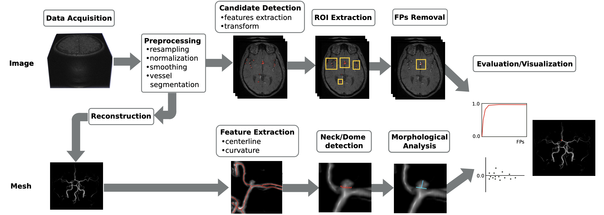

# Aneurysm Detection and Segmentation: A Survey
This repository lists the papers of automated and semi-automated intracranial aneurysm detection and segmentation published before April 2024. Please see the [paper](https://doi.org/10.1016/j.media.2025.103493) for more details. 

## Contents
- [Survey Papers](#survey-papers)

- [Papers](#papers)
  - [3D geometric data](#3d-geometric-data)
    - [Surface mesh](#surface-mesh)
    - [Point sets](#point-sets)
  - [Volumetric data](#volumetric-data)
  - [2D images](#2d-images)

## Survey
**Computer-aided diagnosis systems for detecting intracranial aneurysms using 3D angiographic data sets** \
*H El Hamdaoui, M Maaroufi, B Alami, NE Chaoui, S Boujraf* \
2017 International Conference on Advanced Technologies for Signal and Image Processing (ATSIP)  \
[[Paper](https://doi.org/10.1109/ATSIP.2017.8075568)]

**Role of artificial intelligence in unruptured intracranial aneurysm: an overview** \
*A Marasini, A Shrestha, S Phuyal, OO Zaidat, JS Kalia* \
Frontiers in Neurology 13 (2022) \
[[Paper](https://doi.org/10.3389/fneur.2022.784326)]

**Performance of deep learning in the detection of intracranial aneurysm: a systematic review and meta-analysis** \
*F Gu, X Wu, W Wu, Z Wang, X Yang, Z Chen, Z Wang, G Chen* \
European Journal of Radiology 155 (2022) \
[[Paper](https://doi.org/10.1016/j.ejrad.2022.110457)]

**Detection of cerebral aneurysms using artificial intelligence: a systematic review and meta-analysis** \
*M Din, S Agarwal, M Grzeda, DA Wood, M Modat, TC Booth* \
Journal of NeuroInterventional Surgery 15.3 (2023) \
[[Paper](http://dx.doi.org/10.1136/jnis-2022-019456)]

**A Systematic review of deep-learning methods for intracranial aneurysm detection in CT angiography** \
*Ž Bizjak, Ž Špiclin* \
Biomedicines 11.11 (2023) \
[[Paper](https://doi.org/10.3390/biomedicines11112921)]

### 3D geometric data

#### Surface mesh
**Demarcation of aneurysms using the seed and cull algorithm** \
*RA McLaughlin, JA Noble* \
Medical Image Computing and Computer-Assisted Intervention—MICCAI (2002) \
[[Paper](https://doi.org/10.1007/3-540-45786-0_52)]

**Three-dimensional geometrical characterization of cerebral aneurysms** \
*B Ma, RE Harbaugh, ML Raghavan* \
Annals of biomedical engineering (2004) \
[[Paper](https://doi.org/10.1023/B:ABME.0000012746.31343.92)]

**Augmented vessels for quantitative analysis of vascular abnormalities and endovascular treatment planning** \
*WCK Wong, ACS Chung* \
IEEE transactions on medical imaging (2006) \
[[Paper](https://doi.org/10.1109/TMI.2006.873300)]

**An objective approach to digital removal of saccular aneurysms: technique and applications** \
*MD Ford, Y Hoi, M Piccinelli, L Antiga, DA Steinman* \
The British journal of radiology (2009) \
[[Paper](https://doi.org/10.1259/bjr/67593727)]

**Automated intracranial aneurysm isolation and quantification** \
*I Larrabide, MC Villa-Urio, R Cardenes, JM Pozo, DR Hose, AF Frangi* \
Annual International Conference of the IEEE Engineering in Medicine and Biology (2010) \
[[Paper](https://doi.org/10.1109/IEMBS.2010.5626075)]

**Three‐dimensional morphological analysis of intracranial aneurysms: A fully automated method for aneurysm sac isolation and quantification** \
*I Larrabide, MC Villa‐Uriol, R Cárdenes, JM Pozo, J Macho, LS Roman, J Blasco, E Vivas, A Marzo, DR Hose, AF Frangi* \
Medical physics (2011) \
[[Paper](https://doi.org/10.1118/1.3575417)]

**Computer-aided planning for endovascular treatment of intracranial aneurysms (CAPETA)** \
*A Mohamed, E Sgouritsa, H Morsi, H Shaltoni, ME Mawad, IA Kakadiaris* \
Medical Imaging 2010: Visualization, Image-Guided Procedures, and Modeling (2010) \
[[Paper](https://doi.org/10.1117/12.841042)]

**Geometric reconstruction of the ostium of cerebral aneurysms** \
*M Neugebauer, V Diehl, M Skalej, B Preim* \
VMV (2010) \
[[Paper](http://dx.doi.org/10.2312/PE/VMV/VMV10/307-314)]

**Neck localization and geometry quantification of intracranial aneurysms** \
*E Sgouritsa, A Mohamed, H Morsi, H Shaltoni, ME Mawad, IA Kakadiaris* \
IEEE International Symposium on Biomedical Imaging (2010) \
[[Paper](https://doi.org/10.1109/ISBI.2010.5490172)]

**Detection method of cerebral aneurysm based on curvature analysis from 3D medical images** \
*H Prasetya, TLR Mengko, OS Santoso, H Zakaria* \
International Conference on Instrumentation, Communications, Information Technology, and Biomedical Engineering (2011) \
[[Paper](https://doi.org/10.1109/ICICI-BME.2011.6108612)]

**Automatic neck plane detection and 3D geometric characterization of aneurysmal sacs** \
*M Piccinelli, DA Steinman, Y Hoi, F Tong, A Veneziani, L Antiga* \
Annals of biomedical engineering (2012) \
[[Paper](https://doi.org/10.1007/s10439-012-0577-5)]

**3D vascular decomposition and classification for computer-aided detection** \
*A Chowriappa, S Salunke, M Mokin, P Kan, PD Scott* \
IEEE Transactions on Biomedical Engineering (2013) \
[[Paper](https://doi.org/10.1109/TBME.2013.2272721)]

**Aneurysm identification by analysis of the blood-vessel skeleton** \
*J Kohout, A Chiarini, GJ Clapworthy, G Klajnšek* \
Computer methods and programs in biomedicine (2013) \
[[Paper](https://doi.org/10.1016/j.cmpb.2012.08.018)]

**Semiautomatic neck curve reconstruction for intracranial aneurysm rupture risk assessment based on morphological parameters** \
*S Saalfeld, P Berg, A Niemann, M Luz, B Preim, O Beuing* \
International journal of computer assisted radiology and surgery (2018) \
[[Paper](https://doi.org/10.1007/s11548-018-1848-x)]

**Automatic vessel segmentation and aneurysm detection pipeline for numerical fluid analysis** \
*J Felde, T Wagner, H Lamecker, C Doenitz, L Gundelwein* \
Bildverarbeitung für die Medizin (2021) \
[[Paper](https://doi.org/10.1007/978-3-658-33198-6_57)]

**Visual analysis of aneurysm data using statistical graphics** \
*M Meuschke, T Günther, P Berg, R Wickenhöfer, B Preim, K Lawonn* \
IEEE transactions on visualization and computer graphics (2018) \
[[Paper](https://doi.org/10.1109/TVCG.2018.2864509)]

**A geometric optimization approach for the detection and segmentation of multiple aneurysms** \
*K Lawonn, M Meuschke, R Wickenhöfer, B Preim, K Hildebrandt* \
Computer Graphics Forum (2019) \
[[Paper](https://doi.org/10.1111/cgf.13699)]

**Aneurysm identification in cerebral models with multiview convolutional neural network** \
*M Zhou, X Wang, Z Wu, JM Pozo, AF Frangi* \
Brainlesion: Glioma, Multiple Sclerosis, Stroke and Traumatic Brain Injuries: 5th International Workshop, BrainLes 2019 (2019) \
[[Paper](https://doi.org/10.1007/978-3-030-46640-4_3)]

**Automated cutting plane positioning for intracranial aneurysm quantification** \
*T Jerman, A Chien, F Pernuš, B Likar, Ž Špiclin* \
IEEE Transactions on Biomedical Engineering (2019) \
[[Paper](https://doi.org/10.1109/TBME.2019.2918921)]

**Intracranial aneurysm detection from 3D vascular mesh models with ensemble deep learning** \
*M Zhou, X Wang, Z Wu, JM Pozo, AF Frangi* \
Medical Image Computing and Computer Assisted Intervention–MICCAI (2019) \
[[Paper](https://doi.org/10.1007/978-3-030-32251-9_27)]

**MedmeshCNN-Enabling meshcnn for medical surface models** \
*L Schneider, A Niemann, O Beuing, B Preim, S Saalfeld* \
Computer Methods and Programs in Biomedicine (2021) \
[[Paper](https://doi.org/10.1016/j.cmpb.2021.106372)]

**Deep learning with vessel surface meshes for intracranial aneurysm detection** \
*KM Timmins, IC van der Schaaf, I Vos, YM Ruigrok, BK Velthuis, HJ Kuijf* \
Medical Imaging 2022: Computer-Aided Diagnosis (2022) \
[[Paper](https://doi.org/10.1117/12.2610745)]

#### Point sets
**Surface-based 3D deep learning framework for segmentation of intracranial aneurysms from TOF-MRA images** \
*X Yang, D Xia, T Kin, T Igarashi* \
arXiv preprint (2020) \
[[Paper](https://www.researchgate.net/profile/Ding-Xia-7/publication/342547925_Surface-based_3D_Deep_Learning_Framework_for_Segmentation_of_Intracranial_Aneurysms_from_TOF-MRA_Images/links/603c8b1f299bf1cc26fbdc93/Surface-based-3D-Deep-Learning-Framework-for-Segmentation-of-Intracranial-Aneurysms-from-TOF-MRA-Images.pdf)]

**Vascular surface segmentation for intracranial aneurysm isolation and quantification** \
*Ž Bizjak, B Likar, F Pernuš, Ž Špiclin* \
Medical Image Computing and Computer Assisted Intervention–MICCAI 2020: 23rd International Conference (2020) \
[[Paper](https://doi.org/10.1007/978-3-030-59725-2_13)]

**3D medical point transformer: Introducing convolution to attention networks for medical point cloud analysis** \
*J Yu, C Zhang, H Wang, D Zhang, Y Song, T Xiang, D Liu, and W Cai* \
arXiv preprint arXiv:2112.04863. 2021 Dec 9. (2021) \
[[Paper](https://doi.org/10.48550/arXiv.2112.04863)]
[[Code](https://github.com/crane-papercode/3DMedPT)]

**Modality agnostic intracranial aneurysm detection through supervised vascular surface classification** \
*Ž Bizjak, B Likar, F Pernuš, Ž Špiclin* \
Medical Imaging 2021: Computer-Aided Diagnosis (2021) \
[[Paper](https://doi.org/10.1117/12.2580868)]

**3D intracranial aneurysm classification and segmentation via unsupervised dual-branch learning** \
*D Shao, X Lu, X Liu* \
Journal of Biomedical and Health Informatics (2022) \
[[Paper](https://doi.org/10.1109/JBHI.2022.3180326)]

**Deep learning based modality-independent intracranial aneurysm detection** \
*Ž Bizjak, JH Choi, W Park, Ž Špiclin* \
International Conference on Medical Image Computing and Computer-Assisted Intervention (2022) \
[[Paper](https://doi.org/10.1007/978-3-031-16437-8_73)]

**A two-step surface-based 3D deep learning pipeline for segmentation of intracranial aneurysms** \
*X Yang, D Xia, T Kin, T Igarashi* \
Computational Visual Media 9.1 (2023) \
[[Paper](https://doi.org/10.1007/s41095-022-0270-z)]

-------
### Volumetric data
**Fully-automatic labelling of aneurysm voxels for volume estimation** \
*J Bruijns* \
Proceedings des Workshops (2003) \
[[Paper](https://doi.org/10.1007/978-3-642-18993-7_11)]

**A technique for improved quantitative characterization of intracranial aneurysms** \
*C Karmonik, A Arat, G Benndorf, S Akpek, R Klucznik, ME Mawad, CM Strother* \
American journal of neuroradiology (2004) \
[[Paper](https://www.ajnr.org/content/25/7/1158.short)]

**Automated computerized scheme for detection of unruptured intracranial aneurysms in three-dimensional magnetic resonance angiography** \
*H Arimura, Q Li, Y Korogi, T Hirai, H Abe, Y Yamashita, S Katsuragawa, R Ikeda, Kunio Doi* \
Academic radiology (2004) \
[[Paper](https://doi.org/10.1016/j.acra.2004.07.011)]

**Local distance thresholds for enhanced aneurysm labelling** \
*J Bruijns* \
Bildverarbeitung für die Medizin (2005) \
[[Paper](https://doi.org/10.1007/3-540-26431-0_31)]

**Computer-aided diagnosis of intracranial aneurysms in MRA images with case-based reasoning** \
*S Kobashi, K Kondo, Y Hata* \
IEICE TRANSACTIONS on Information and Systems (2006) \
[[Paper](https://doi.org/10.1093/ietisy/e89-d.1.340)]

**Computer-aided diagnosis scheme for detection of unruptured intracranial aneurysms in MR angiography** \
*Y Uchiyama, H Ando, R Yokoyama, T Hara, H Fujita, T Iwama* \
IEEE engineering in medicine and biology 27th annual conference (2006) \
[[Paper](https://doi.org/10.1109/IEMBS.2005.1617113)]

**Computerized detection of intracranial aneurysms for three‐dimensional MR angiography: Feature extraction of small protrusions based on a shape‐based difference image technique** \
*H Arimura, Q Li, Y Korogi, T Hirai, S Katsuragawa, Y Yamashita, K Tsuchiya, K Doi* \
Medical physics (2006) \
[[Paper](https://doi.org/10.1118/1.2163389)]

**Fully-automatic correction of the erroneous border areas of an aneurysm** \
*J Bruijns, FJ Peters, RPM Berretty, B Barenbrug* \
Bildverarbeitung für die Medizin (2007) \
[[Paper](https://doi.org/10.1007/978-3-540-71091-2_59)]

**Automated detection of intracranial aneurysms based on parent vessel 3D analysis** \
*A Lauric, E Miller, S Frisken, AM Malek* \
Medical image analysis (2010) \
[[Paper](https://doi.org/10.1016/j.media.2009.10.005)]

**Three-dimensional semi-automatic segmentation of intracranial aneurysms in CTA** \
*A Nikravanshalmani, SD Qanadli, TJ Ellis, M Crocker, Y Ebrahimdoost, M Karamimohammadi* \
Proceedings of the 10th IEEE International Conference on Information Technology and Applications in Biomedicine (2010) \
[[Paper](https://doi.org/10.1109/ITAB.2010.5687759)]

**Automatic aneurysm neck detection using surface Voronoi diagrams** \
*R Cárdenes, JM Pozo, H Bogunovic, I Larrabide, AF Frangi* \
IEEE transactions on medical imaging (2011) \
[[Paper](https://doi.org/10.1109/TMI.2011.2157698)]

**Automatic cerebral aneurysm detection in multimodal angiographic images** \
*CM Hentschke, O Beuing, R Nickl, KD Tönnies* \
IEEE nuclear science symposium conference record (2011) \
[[Paper](https://doi.org/10.1109/NSSMIC.2011.6152566)]

**Automatic localization and quantification of intracranial aneurysms** \
*S Hassan, F Hétroy, F Faure, O Palombi* \
International Conference on Computer Analysis of Images and Patterns (2011) \
[[Paper](https://doi.org/10.1007/978-3-642-23672-3_67)]

**Computer-aided detection of intracranial aneurysms in MR angiography** \
*X Yang, DJ Blezek, LTE Cheng, WJ Ryan, DF Kallmes, BJ Erickson* \
Journal of digital imaging (2011) \
[[Paper](https://doi.org/10.1007/s10278-009-9254-0)]

**A new feature for automatic aneurysm detection** \
*CM Hentschke, KD Tönnies, O Beuing, R Nickl* \
IEEE International Symposium on Biomedical Imaging (ISBI) (2012) \
[[Paper](https://doi.org/10.1109/ISBI.2012.6235669)]

**Computer-aided detection of aneurysms in 3D time-of-flight MRA datasets** \
*S Suniaga, R Werner, A Kemmling, M Groth, J Fiehler, ND Forkert* \
Machine Learning in Medical Imaging: Third International Workshop, MLMI (2012) \
[[Paper](https://doi.org/10.1007/978-3-642-35428-1_8)]

**Segmentation and separation of cerebral aneurysms: a multi-phase approach** \
*A Nikravanshalmani, M Karamimohammdi, J Dehmeshki* \
2013 8th International Symposium on Image and Signal Processing and Analysis (ISPA) (2013) \
[[Paper](https://doi.org/10.1109/ISPA.2013.6703793)]

**A system to detect cerebral aneurysms in multimodality angiographic data sets** \
*CM Hentschke, O Beuing, H Paukisch, C Scherlach, M Skalej, KD Tönnies* \
Medical physics (2014) \
[[Paper](https://doi.org/10.1118/1.4890775)]

**Performance improvement in computerized detection of cerebral aneurysms by retraining classifier using feedback data collected in routine reading environment** \
*Y Nomura, Y Masutani, S Miki, M Nemoto, S Hanaoka, T Yoshikawa, N Hayashi, K Ohtomo* \
Journal of Biomedical Graphics and Computing (2014) \
[[Paper](https://doi.org/10.5430/jbgc.v4n4p12)]

**Segmentation of the thrombus of giant intracranial aneurysms from CT angiography scans with lattice Boltzmann method** \
*Y Chen, L Navarro, Y Wang, G Courbebaisse* \
Medical image analysis (2014) \
[[Paper](https://doi.org/10.1016/j.media.2013.08.003)]

**Blob enhancement and visualization for improved intracranial aneurysm detection** \
*T Jerman, F Pernuš, B Likar, Ž Špiclin* \
IEEE Transactions on Visualization and Computer Graphics (2015) \
[[Paper](https://doi.org/10.1109/TVCG.2015.2446493)]
[[Code](https://github.com/timjerman/JermanEnhancementFilter)]

**Computer-aided detection and quantification of intracranial aneurysms** \
*T Jerman, F Pernuš, B Likar, Ž Špiclin* \
Medical Image Computing and Computer-Assisted Intervention--MICCAI (2015) \
[[Paper](https://doi.org/10.1007/978-3-319-24571-3_1)]

**HoTPiG: a novel geometrical feature for vessel morphometry and its application to cerebral aneurysm detection** \
*S Hanaoka, Y Nomura, M Nemoto, S Miki, T Yoshikawa, N Hayashi, K Ohtomo, Y Masutani, A Shimizu * \
Medical Image Computing and Computer-Assisted Intervention--MICCAI (2015) \
[[Paper](https://doi.org/10.1007/978-3-319-24571-3_13)]

**An ellipsoid convex enhancement filter for detection of asymptomatic intracranial aneurysm candidates in CAD frameworks** \
*Z Jin, H Arimura, S Kakeda, F Yamashita, M Sasaki, Y Korogi* \
Medical physics (2016) \
[[Paper](https://doi.org/10.1118/1.4940349)]

**Deep learning–assisted diagnosis of cerebral aneurysms using the HeadXNet model** \
*A Park, C Chute, P Rajpurkar, J Lou, RL Ball, et al.* \
JAMA network open 2.6 (2016) \
[[Paper](https://dx.doi.org/10.1001/jamanetworkopen.2019.5600)]

**Aneurysm detection in 3D cerebral angiograms based on intra-vascular distance mapping and convolutional neural networks** \
*T Jerman, F Pernus, B Likar, Ž Špiclin* \
IEEE 14th international symposium on biomedical imaging (2017) \
[[Paper](https://doi.org/10.1109/ISBI.2017.7950595)]

**Deep neural network‐based computer‐assisted detection of cerebral aneurysms in MR angiography** \
*T Nakao, S Hanaoka, Y Nomura, I Sato, M Nemoto, S Miki, E Maeda, T Yoshikawa, N Hayashi, O Abe* \
Journal of Magnetic Resonance Imaging (2018) \
[[Paper](https://doi.org/10.1002/jmri.25842)]

**Deep learning–based detection of intracranial aneurysms in 3D TOF-MRA** \
*T Sichtermann, A Faron, R Sijben, N Teichert, J Freiherr, M Wiesmann* \
American Journal of Neuroradiology (2019) \
[[Paper](https://doi.org/10.3174/ajnr.A5911)]

**Deep learning for MR angiography: automated detection of cerebral aneurysms** \
*D Ueda, A Yamamoto, M Nishimori, T Shimono, S Doishita, A Shimazaki, Y Katayama, S Fukumoto, A Choppin, Y Shimahara, Y Miki* \
Radiology (2019) \
[[Paper](https://doi.org/10.1148/radiol.2018180901)]

**1D CNN‐based intracranial aneurysms detection in 3D TOF‐MRA** \
*W Hou, S Mei, Q Gui, Y Zou, Y Wang, X Deng, Q Cheng* \
Complexity (2020) \
[[Paper](https://doi.org/10.1155/2020/7023754)]

**3D attention U-net with pretraining: A solution to CADA-aneurysm segmentation challenge** \
*Z Su, Y Jia, W Liao, Y Lv, J Dou, Z Sun, X Li* \
Cerebral Aneurysm Detection and Analysis: First Challenge, CADA 2020, Held in Conjunction with MICCAI 2020 (2020) \
[[Paper](https://doi.org/10.1007/978-3-030-72862-5_6)]

**A clinically applicable deep-learning model for detecting intracranial aneurysm in computed tomography angiography images** \
*Z Shi, C Miao, UJ Schoepf, RH Savage, DM Dargis, C Pan, X Chai, XL Li, S Xia, X Zhang, et al.* \
Nature communications (2020) \
[[Paper](https://doi.org/10.1038/s41467-020-19527-w)]

**A deep learning algorithm may automate intracranial aneurysm detection on MR angiography with high diagnostic performance** \
*B Joo, SS Ahn, PH Yoon, S Bae, B Sohn, YE Lee, JH Bae, MS Park, HS Choi, SK Lee* \
European Radiology (2020) \
[[Paper](https://doi.org/10.1007/s00330-020-06966-8)]

**Aν-Net: automatic detection and segmentation of aneurysm** \
*S Shit, I Ezhov, JC Paetzold, B Menze* \
Cerebral Aneurysm Detection and Analysis: First Challenge, CADA 2020, Held in Conjunction with MICCAI 2020 (2020) \
[[Paper](https://doi.org/10.1007/978-3-030-72862-5_5)]

**Automated computer-assisted detection system for cerebral aneurysms in time-of-flight magnetic resonance angiography using fully convolutional network** \
*G Chen, X Wei, H Lei, Y Liqin, L Yuxin, D Yakang, G Daoying* \
BioMedical Engineering (2020) \
[[Paper](https://doi.org/10.1186/s12938-020-00770-7)]

**Automatic detection of intracranial aneurysms in 3D-DSA based on a Bayesian optimized filter** \
*T Hu, H Yang, W Ni, Y Lei, Z Jiang, K Shi, J Yu, Y Gu, Y Wang* \
BioMedical Engineering OnLine (2020) \
[[Paper](https://doi.org/10.1186/s12938-020-00817-9)]

**Deep learning-based 3D U-Net cerebral aneurysm detection** \
*M Ivantsits, JM Kuhnigk, M Huellebrand, T Kuehne, A Hennemuth* \
Cerebral Aneurysm Detection and Analysis: First Challenge, CADA 2020, Held in Conjunction with MICCAI 2020 (2020) \
[[Paper](https://doi.org/10.1007/978-3-030-72862-5_3)]

**Detect and identify aneurysms based on adjusted 3D attention UNet** \
*Y Jia, W Liao, Y Lv, Z Su, J Dou, Z Sun, X Li* \
Cerebral Aneurysm Detection and Analysis: First Challenge, CADA 2020, Held in Conjunction with MICCAI 2020 (2020) \
[[Paper](https://doi.org/10.1007/978-3-030-72862-5_4)]

**Exploring large context for cerebral aneurysm segmentation** \
*J Ma, Z Nie* \
Cerebral Aneurysm Detection and Analysis: First Challenge, CADA 2020, Held in Conjunction with MICCAI 2020 (2020) \
[[Paper](https://doi.org/10.1007/978-3-030-72862-5_7)]

**Fully automated detection and segmentation of intracranial aneurysms in subarachnoid hemorrhage on CTA using deep learning** \
*R Shahzad, L Pennig, L Goertz, F Thiele, C Kabbasch, M Schlamann, B Krischek, D Maintz, M Perkuhn & J Borggrefe* \
Nature Scientific Reports (2020) \
[[Paper](https://doi.org/10.1038/s41598-020-78384-1)]

**Incidental cerebral aneurysms detected by a computer-assisted detection system based on artificial intelligence: a case series** \
*Y Shimada, T Tanimoto, M Nishimori, A Choppin, A Meir, A Ozaki, A Higuchi, M Kosaka, Y Shimahara, N Kitamura* \
Medicine (2020) \
[[Paper](https://doi.org/10.1097/md.0000000000021518)]

**Performance of a deep-learning neural network to detect intracranial aneurysms from 3D TOF-MRA compared to human readers** \
*A Faron, T Sichtermann, N Teichert, JA Luetkens, A Keulers, O Nikoubashman, J Freiherr, A Mpotsaris, M Wiesmann * \
Clinical neuroradiology (2020) \
[[Paper](https://doi.org/10.1007/s00062-019-00809-w)]

**Retina U-Net for aneurysm detection in MR images** \
*M Baumgartner, P Jaeger, F Isensee, KH Maier-Hein* \
Automatic Detection and SegMentation Challenge (ADAM) (2020) \
[[Paper](https://adam.isi.uu.nl/wp-content/uploads/2020/10/mibaumgartner_2020_ADAM.pdf)]

**An efficient data strategy for the detection of brain aneurysms from MRA with deep learning** \
*Y Assis, L Liao, F Pierre, R Anxionnat, E Kerrien* \
Deep Generative Models, and Data Augmentation, Labelling, and Imperfections (2021) \
[[Paper](https://doi.org/10.1007/978-3-030-88210-5_22)]

**Cerebral aneurysm image segmentation based on multi-modal convolutional neural network** \
*C Meng, D Yang, D Chen* \
Computer Methods and Programs in Biomedicine (2021) \
[[Paper](https://doi.org/10.1016/j.cmpb.2021.106285)]

**Deep learning for detecting cerebral aneurysms with CT angiography** \
*J Yang, M Xie, C Hu, O Alwalid, Y Xu, J Liu, T Jin, C Li, D Tu, X Liu, C Zhang, C Li, X Long* \
Radiology (2021) \
[[Paper](https://doi.org/10.1148/radiol.2020192154)]
[[Code](https://github.com/CTA-detection/DLCA)]

**Deep neural network-based detection and segmentation of intracranial aneurysms on 3D rotational DSA** \
*X Liu, J Feng, Z Wu, Z Neo, C Zhu, P Zhang, Y Wang, Y Jiang, D Mitsouras, Y Li* \
Interventional Neuroradiology (2021) \
[[Paper](https://doi.org/10.1177/15910199211000956)]

**Enriching computed tomography images by projection for robust automated cerebral aneurysm detection and segmentation** \
*R Ma, S Tu, P Li, J Zhou, B Zhao, J Wan, L Xu* \
IEEE International Conference on Bioinformatics and Biomedicine (BIBM) (2021) \
[[Paper](https://doi.org/10.1109/BIBM52615.2021.9669853)]

**Toward human intervention-free clinical diagnosis of intracranial aneurysm via deep neural network** \
*ZH Bo, H Qiao, C Tian, Y Guo, W Li, T Liang, D Li, et al.* \
Patterns 2.2 (2021) \
[[Paper](https://www.cell.com/patterns/fulltext/S2666-3899(20)30267-1)]
[[Code](https://github.com/MeteorsHub/GLIA-Net)]

**Computer-assisted detection of intracranial aneurysms using a transformer deep neural network in 3D MR angiography** \
*E Zhou, F Huang* \
Research Sqaure Preprint (2022) \
[[Paper](https://doi.org/10.21203/rs.3.rs-1355959/v1)]

**DCAU-Net: dense convolutional attention U-Net for segmentation of intracranial aneurysm images** \
*W Yuan, Y Peng, Y Guo, Y Ren, Q Xue* \
Visual computing for industry, biomedicine, and art (2022) \
[[Paper](https://doi.org/10.1186/s42492-022-00110-7)]

**Deep learning-based recognition and segmentation of intracranial aneurysms under small sample size** \
*G Zhu, X Luo, T Yang, L Cai, JH Yeo, G Yan, J Yang* \
Frontiers in Physiology (2022) \
[[Paper](https://doi.org/10.3389/fphys.2022.1084202)]

**Evaluation of an automated intracranial aneurysm detection and rupture analysis approach using cascade detection and classification networks** \
*K Wu, D Gu, P Qi, X Cao, D Wu, L Chen, G Qu, J Wang, X Pan, X Wang, Y Chen, L Chen, Z Xue, J Lyu* \
Computerized Medical Imaging and Graphics 102 (2022) \
[[Paper](https://doi.org/10.1016/j.compmedimag.2022.102126)]

**OTO‐Net: an automated MRA image segmentation network for intracranial aneurysms** \
*J Ye, X Xu, L Li, J Zhao, W Lai, W Zhou, C Zheng, X Wang, X Lai* \
Computational Intelligence and Neuroscience (2022) \
[[Paper](https://doi.org/10.1155/2022/5333589)]

**Segmentation method of cerebral aneurysms based on entropy selection strategy** \
*T Li, X An, Y Di, J He, S Liu, D Ming* \
MDPI Entropy (2022) \
[[Paper](https://doi.org/10.3390/e24081062)]

**Aneurysm pose estimation with deep learning** \
*Y Assis, L Liao, F Pierre, R Anxionnat, E Kerrien* \
Medical Image Computing and Computer Assisted Intervention – MICCAI (2023) \
[[Paper](https://doi.org/10.1007/978-3-031-43895-0_51)]
[[Code](https://gitlab.inria.fr/yassis/DeepAnePose)]

**Automated detection of intracranial aneurysms using skeleton-based 3D patches, semantic segmentation, and auxiliary classification for overcoming data imbalance in brain TOF-MRA** \
*S Ham, J Seo, J Yun, YJ Bae, T Kim, L Sunwoo, S Yoo, SC Jung, JW Kim, N Kim* \
Scientific Reports (2023) \
[[Paper](https://doi.org/10.1038/s41598-023-38586-9)]

**Dense, deep learning-based intracranial aneurysm detection on TOF MRI using two-stage regularized U-Net** \
*F Claux, M Baudouin, C Bogey, A Rouchaud* \
Journal of Neuroradiology (2023) \
[[Paper](https://doi.org/10.1016/j.neurad.2022.03.005)]

**Detection of intracranial aneurysms using multiphase CT angiography with a deep learning model** \
*J Wang, J Sun, J Xu, S Lu, H Wang, C Huang, F Zhang, Y Yu, X Gao, M Wang, Y Wang, X Ruan, Y Pan* \
Academic Radiology 30.11 (2023) \
[[Paper](https://doi.org/10.1016/j.acra.2022.12.043)]

**FSTIF-UNet: a deep learning-based method towards automatic segmentation of intracranial aneurysms in un-reconstructed 3D-RA** \
*J Zhang, Y Zhao, X Liu, J Jiang, Y Li* \
IEEE Journal of Biomedical and Health Informatics (2023) \
[[Paper](https://doi.org/10.1109/JBHI.2023.3278472)]

**High-throughput 3dra segmentation of brain vasculature and aneurysms using deep learning** \
*F Lin, Y Xia, S Song, N Ravikumar, AF Frangi* \
Computer Methods and Programs in Biomedicine (2023) \
[[Paper](https://doi.org/10.1016/j.cmpb.2023.107355)]

**Towards automated brain aneurysm detection in TOF-MRA: open data, weak labels, and anatomical knowledge** \
*T Di Noto, G Marie, S Tourbier, Y Alemán-Gómez, O Esteban, G Saliou, MB Cuadra, P Hagmann, J Richiardi* \
Neuroinformatics (2023) \
[[Paper](https://doi.org/10.1007/s12021-022-09597-0)]
[[Code](https://github.com/connectomicslab/Aneurysm_Detection)]

**A deep learning framework for intracranial aneurysms automatic segmentation and detection on magnetic resonance T1 images** \
*J Qu, H Niu, Y Li, T Chen, F Peng, J Xia, X He, B Xu, X Chen, R Li, A Liu, X Zhang, C Li* \
European Radiology (2024) \
[[Paper](https://doi.org/10.1007/s00330-023-10295-x)]

**A deep-learning model for intracranial aneurysm detection on CT angiography images in China: a stepwise, multicentre, early-stage clinical validation study** \
*B Hu, Z Shi, L Lu, Z Miao, H Wang, Z Zhou, F Zhang, R Wang, X Luo, F Xu, S Li, X Fang, et al.* \
The Lancet Digital Health (2024) \
[[Paper](https://www.thelancet.com/journals/landig/article/PIIS2589-7500(23)00268-6/fulltext)]
[[Code](https://github.com/deepwise-code/CAIA)]

**Semi-supervised intracranial aneurysm segmentation via reliable weight selection** \
*W Cao, X Chen, J Lv, L Shao, W Si* \
The Visual Computer (2024) \
[[Paper](https://doi.org/10.1007/s00371-024-03730-7)]
[[Code](https://github.com/jinxiaokuang/RWS-MT)]

**Morphology and Texture-Guided Deep Neural Network for Intracranial Aneurysm Segmentation in 3D TOF-MRA** \
*M Orouskhani, N Firoozeh, H Wang, Y Wang, H Shi, W Li, B Sun, J Zhang, X Li, H Zhao, M Mossa‑Basha, J‑N H, C Zhu* \
Neuroinformatics (2024) \
[[Paper](https://doi.org/10.1007/s12021-024-09683-5)]

### 2D images
**Detection of cerebral aneurysms by using time based parametric color coded of cerebral angiogram** \
*H Zakaria, A Kurniawan, TLR Mengko, OS Santoso* \
Proceedings of the 2011 International Conference on Electrical Engineering and Informatics (2011) \
[[Paper](https://doi.org/10.1109/ICEEI.2011.6021503)]

**Detection of cerebral aneurysm by performing thresholding-spatial filtering-thresholding operations on digital subtraction angiogram** \
*J Mitra, A Chandra* \
Proceedings of the Second International Conference on Advances in Computing and Information Technology (ACITY) (2013) \
[[Paper](https://doi.org/10.1007/978-3-642-31552-7_93)]

**Peak trekking of hierarchy mountain for the detection of cerebral aneurysm using modified Hough circle transform** \
*J Mitra, A Chandra, T Halder* \
ELCVIA Electronic Letters on Computer Vision and Image Analysis (2013) \
[[Paper](https://doi.org/10.5565/rev/elcvia.529)]
[[Code](https://github.com/jm61288/aneurysm_detection)]

**Detection of intracranial aneurysm in angiographic images using fuzzy approaches** \
*I Rahmany, N Khlifa* \
International Image Processing, Applications and Systems Conference (2014) \
[[Paper](https://doi.org/10.1109/IPAS.2014.7043312)]

**One novel algorithm for the detection of Cerebral Aneurysm using morphological filtering** \
*S Mondal, A Chandra* \
International Conference on Communication and Signal Processing (2014) \
[[Paper](https://doi.org/10.1109/ICCSP.2014.6949815)]

**Semi-automatic detection and segmentation algorithm of saccular aneurysms in 2D cerebral DSA images** \
*N Sulayman, M Al-Mawaldi, Q Kanafani* \
The Egyptian Journal of Radiology and Nuclear Medicine (2016) \
[[Paper](https://doi.org/10.1016/j.ejrnm.2016.03.016)]

**Amalgamation of iterative double automated thresholding and morphological filtering: a new proposition in the early detection of cerebral aneurysm** \
*A Chandra, S Mondal* \
Multimedia Tools and Applications (2017) \
[[Paper](https://doi.org/10.1007/s11042-016-4149-9)]

**A framework for intracranial saccular aneurysm detection and quantification using morphological analysis of cerebral angiograms** \
*KM Malik, SM Anjum, H Soltanian-Zadeh, H Malik, GM Malik* \
IEEE Access (2018) \
[[Paper](https://doi.org/10.1109/ACCESS.2018.2799307)]

**A fully automatic based deep learning approach for aneurysm detection in DSA images** \
*I Rahmany, R Guetari, N Khlifa* \
2018 IEEE international conference on image processing, applications and systems (IPAS) (2018) \
[[Paper](https://doi.org/10.1109/IPAS.2018.8708897)]

**A priori knowledge integration for the detection of cerebral aneurysm** \
*I Rahmany, N Khlifa* \
Biomedical Engineering/Biomedizinische Technik (2018) \
[[Paper](https://doi.org/10.1515/bmt-2016-0168)]

**Cerebral aneurysm computer-aided detection system by combing MSER, SURF and SIFT descriptors** \
*I Rahmany, B Arfaoui, N Khlifa, H Megdiche* \
2018 5th international conference on control, decision and information technologies (CoDIT) (2018) \
[[Paper](https://doi.org/10.1109/CoDIT.2018.8394937)]

**Saccular brain aneurysm detection and multiclassifier rupture prediction using digital subtraction and magnetic resonance angiograms** \
*SM Anjum, KM Malik, H Soltanian-Zadeh, H Malik, G Malik* \
Proceedings of the 2018 5th International Conference on Biomedical and Bioinformatics Engineering (2018) \
[[Paper](https://doi.org/10.1145/3301879.3301899)]

**Automatic detection of intracranial aneurysm from digital subtraction angiography with cascade networks** \
*J Liao, H Duan, H Dai, Y Huang, L Liu, L Chen, L Zhou* \
Proceedings of the 2nd International Conference on Artificial Intelligence and Pattern Recognition (2019) \
[[Paper](https://doi.org/10.1145/3357254.3357258)]

**Automatic detection of intracranial aneurysm using LBP and Fourier descriptor in angiographic images** \
*I Rahmany, MEA Nemmala, N Khlifa, H Megdiche* \
International journal of computer assisted radiology and surgery (2019) \
[[Paper](https://doi.org/10.1007/s11548-019-01996-0)]

**Automatic detection on intracranial aneurysm from digital subtraction angiography with cascade convolutional neural networks** \
*H Duan, Y Huang, L Liu, H Dai, L Chen, L Zhou* \
Biomedical engineering online (2019) \
[[Paper](https://doi.org/10.1186/s12938-019-0726-2)]

**Automatic diagnosis based on spatial information fusion feature for intracranial aneurysm** \
*Y Zeng, X Liu, N Xiao, Y Li, Y Jiang, J Feng, S Guo* \
IEEE transactions on medical imaging (2019) \
[[Paper](https://doi.org/10.1109/TMI.2019.2951439)]

**Brain Aneurysm Extraction in MRI Images** \
*RHA Rauf, NA Ghafar, NEA Khalid* \
Proceedings of the 2019 8th International Conference on Software and Computer Applications (2019) \
[[Paper](https://doi.org/10.1145/3316615.3316696)]

**Convolutional neural networks for the detection and measurement of cerebral aneurysms on magnetic resonance angiography** \
*JN Stember, P Chang, DM Stember, M Liu, J Grinband, CG Filippi, P Meyers, S Jambawalikar* \
Journal of digital imaging (2019) \
[[Paper](https://doi.org/10.1007/s10278-018-0162-z)]

**Fully automated unruptured intracranial aneurysm detection and segmentation from digital subtraction angiography series using an end-to-end spatiotemporal deep neural network** \
*H Jin, Y Yin, M Hu, G Yang, L Qin* \
Medical imaging 2019: Image processing (2019) \
[[Paper](https://doi.org/10.1117/12.2512623)]

**Automatic radiomic feature extraction using deep learning for angiographic parametric imaging of intracranial aneurysms** \
*AR Podgorsak, RA Rava, MMS Bhurwani, AR Chandra, JM Davies, AH Siddiqui, CN Ionita* \
Journal of neurointerventional surgery (2020) \
[[Paper](https://doi.org/10.1136/neurintsurg-2019-015214)]

**Deep learning based detection of intracranial aneurysms on digital subtraction angiography: a feasibility study** \
*N Hainc, M Mannil, V Anagnostakou, H Alkadhi, C Blüthgen, L Wacht, A Bink, S Husain, Z Kulcsár, S Winklhofer* \
The neuroradiology journal (2020) \
[[Paper](https://doi.org/10.1177/1971400920937647)]

**Deep learning for automated cerebral aneurysm detection on computed tomography images** \
*X Dai, L Huang, Y Qian, S Xia, W Chong, J Liu, A Di Ieva, X Hou, C Ou* \
International Journal of Computer Assisted Radiology and Surgery (2020) \
[[Paper](https://doi.org/10.1007/s11548-020-02121-2)]

**A diagnostic system for intracranial saccular and fusiform aneurysms with location detection** \
*Y Zafar, A Javed, KM Malik, J Santamaria, G Malik* \
2021 IEEE EMBS International Conference on Biomedical and Health Informatics (BHI) (2021) \
[[Paper](https://doi.org/10.1109/BHI50953.2021.9508536)]

**A new deep neural segmentation network for cerebral aneurysms in 2D digital subtraction angiography** \
*S Kashyap, H Bulu, A Jadhav, R Dholakia, AY Liu, H Rangwala, WR Patterson, M Moradi* \
Medical Imaging 2022: Image-Guided Procedures, Robotic Interventions, and Modeling (2022) \
[[Paper](https://doi.org/10.1117/12.2611205)]

**DeepInfusion: a dynamic infusion based-neuro-symbolic AI model for segmentation of intracranial aneurysms** \
*I Abdullah, A Javed, KM Malik, G Malik* \
Neurocomputing 551 (2023) \
[[Paper](https://doi.org/10.1016/j.neucom.2023.126510)]

**Focusing intracranial aneurysm lesion segmentation by graph mask2Former with local refinement in DSA images** \
*Y Mo, Y Chen, Y Hu, J Xu, H Wang, L Dai, J Liu* \
IEEE International Conference on Bioinformatics and Biomedicine (BIBM) (2023) \
[[Paper](https://doi.org/10.1109/BIBM58861.2023.10385276)]

